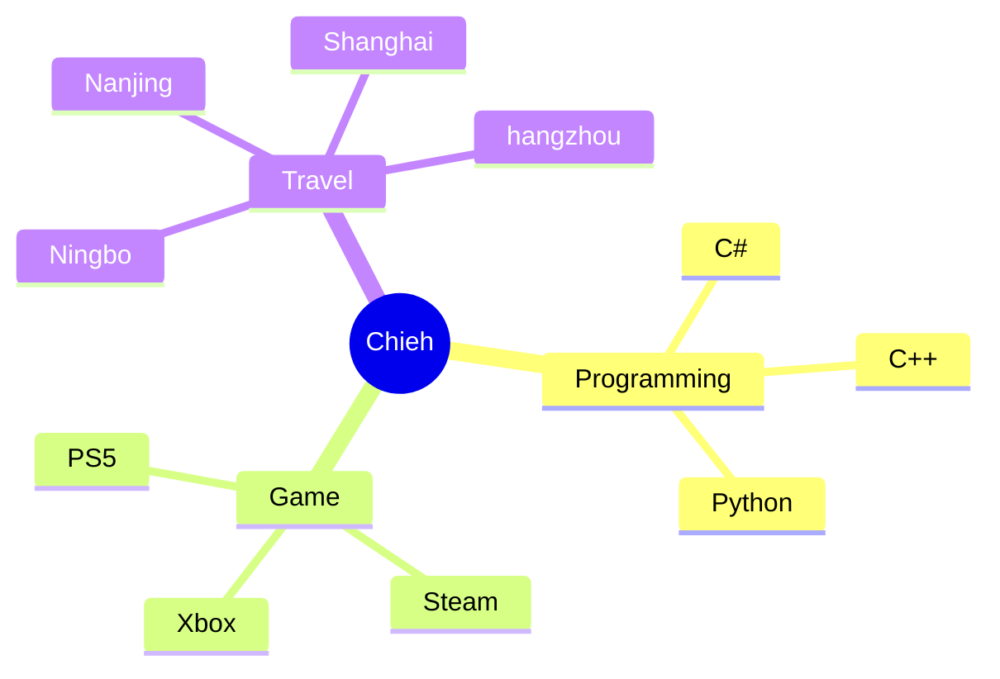

<!-- just img 图片 -->

 
### 👋  I'm Chieh.
- 🔭 I’m currently learning programming.
- 🌱 I believe tomorrow will be better.
- 📫 How to reach me: chieh@chieh.email
- 😄 Read more about my blog: [here](https://www.chieh.pro/)

<!-- Quotes 名人名言 -->

### My Skill Set

### My hobbies

<!-- just img 图片 -->

<!-- svg -->

 

 

<!-- gif -->

